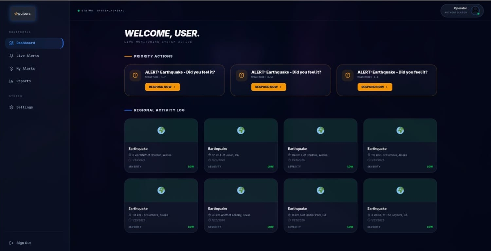
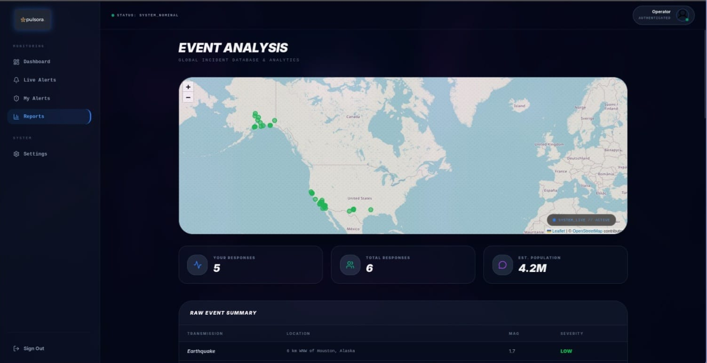
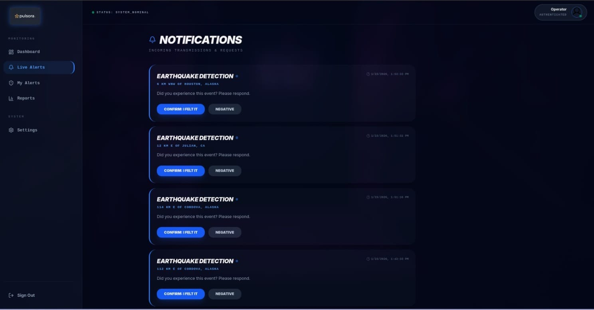
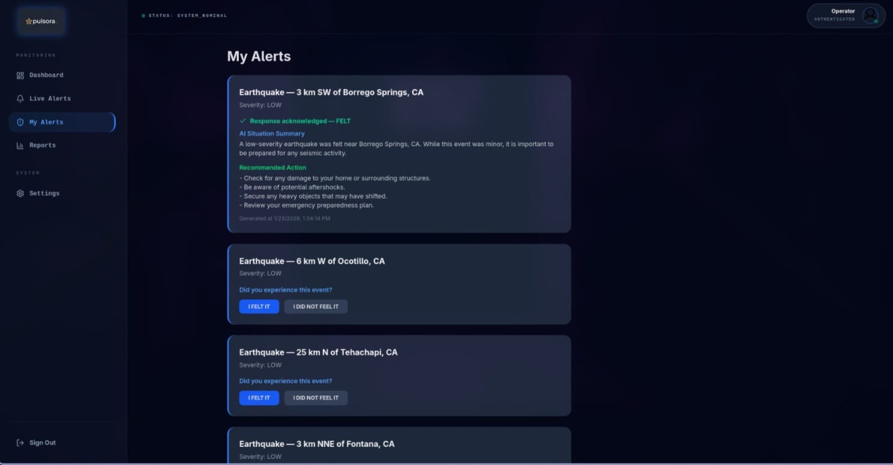

Pulsora – AI-Powered Disaster Management System

Pulsora is an intelligent disaster management and response platform built with Spring Boot, Gemini AI, and JWT-secured microservices. It enables communities to track disasters, collect on-ground feedback, and receive personalized AI-driven safety guidance, all visualized on an interactive map interface.

# Overview

Pulsora bridges human input and AI intelligence to transform disaster reporting into actionable insights. Users report events, share experiences, and receive Gemini-powered recommendations that adapt to their specific situation and location. By closing the feedback loop between victims and responders, Pulsora ensures that safety guidance is contextual and immediate.

* Core Features

- User Management

Secure Authentication: Signup and login with JWT (JSON Web Tokens).

Proximity Tracking: User tracking by location for localized alerts.

Activity Monitoring: Automatic update of last active time to identify users in danger zones.

- Disaster Event Management

Event Registry: Register and track disaster events such as earthquakes and floods.

Severity Classification: LOW, MEDIUM, HIGH.

Status Lifecycle: REPORTED → CONFIRMED → RESOLVED.

Automated Logging: Auto-generated timestamps for all reporting phases.

- Two-Way User Response System

Status Reporting: Users submit responses: FELT, NOT_FELT, NO_RESPONSE.

Experience Sharing: Optional custom descriptions of personal experiences on the ground.

Relational Data: Each response is linked to a specific User and Disaster Event for contextual analysis.

~ Gemini AI Analysis Engine

Pulsora integrates the Gemini 1.5-Pro API to analyze user responses and event data. The AI generates aggregate summaries of disaster events and personalized safety recommendations for each user.

> How It Works

Detection: Detects unusual activity and potential disasters using external APIs.

Phase-I Notification: Sends initial proximity-based alerts to affected users.

Crowdsourcing: Users report their experiences and local conditions.

Prompt Construction: Pulsora constructs a structured prompt using user and event data.

AI Processing: The Gemini API processes the prompt and generates tailored guidance.

Phase-II Notification: The AI response is stored and delivered as a personalized safety instruction.

Example Prompt Logic

You are an AI disaster support assistant.
Generate a short personalized response for the user, including:
1. A concise summary of their situation based on their "FELT" status.
2. A clear recommended action for their specific coordinates.

+ Tech Stack

Backend: Spring Boot, Spring Data JPA, PostgreSQL, Maven

Frontend: React, Vite, Tailwind CSS

AI Engine: Gemini 1.5-Pro API (Google AI Studio)

Authentication: Spring Security, JWT

Infrastructure: Docker, Docker Compose

@ Interface Gallery

! Project Highlights

Real-time Interaction: Two-way response system for immediate ground-truth data.

Adaptive AI: Personalized safety assistance rather than generic broadcasts.

Visual Intelligence: Event-triggered proximity alerts and heatmaps.

Production Ready: Secure, scalable, and containerized deployment.
